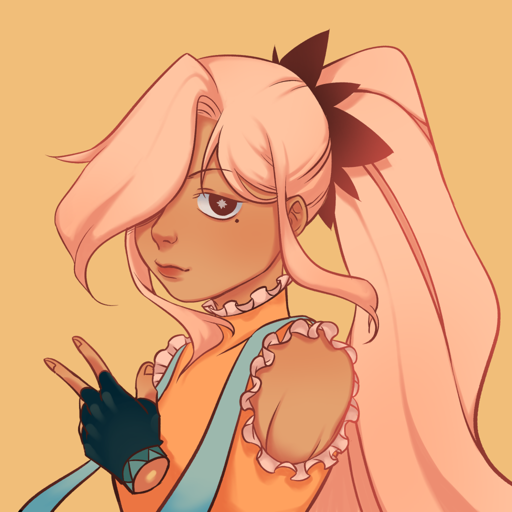

<!DOCTYPE html>
<head>
    <title>Exercise11</title>
    <link href="Exercise11.css" rel="stylesheet">
    <meta name="author" content="Ninna Alessandra Santiago">
    <meta name="viewport" content="width=device-width, initial-scale=1.0">
    <meta name="keywords" content="CSS">
</head>
<body>
    

        
        
    

    

        
    

    

        
        
        
    

    

        
        
        
        
    

</body>
</html>